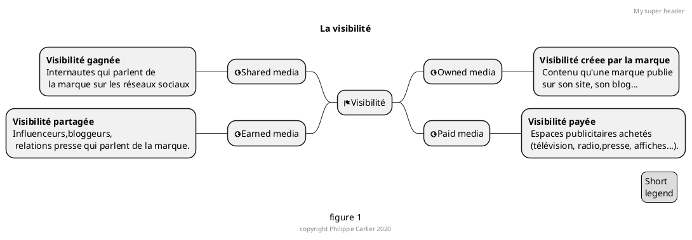
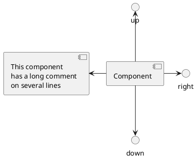

# L'évolution de la communication et l'impact du digital

>A partir des années 2000 le développement d'intemet a modifié le schéma de communication traditionnelle entre les marques et leuts clients ou prospects.

## Une communication multicanale
Internet a permis de multiplier les canaux de communication entre les marques et les consommateurs et a permis aux marques de diffuser plus largement des informations sur leurs produits. leursvaleurs, etc, Contrairement aux médias traditionnels (journaux, affiches...). Internet représente une opportunité pour les marques de touchef gratuitement et facilement un plus grand nombre de clients potentiels

La communication des marques ne passe plus W"iquement par l'achat dun espacecoüteux et limité sur des suppcrts tels que la rad'0, latélévision, l'affchage ou la presse repaid medial Sur Internet, les marqaes possédent leur prcpreespacedecornml.ni•
cation, grice leur site Internet ou leur blog (owned media) et peuvent partager des contenus sur les réseaux sociaux (sharedmedia)- Elles incitent également les influenceurs au bloggeurs publier du contenu sur edes, ce qui leur permet d'accroitre leur visibilité (earned media).

NOTE STT TESTER CE FORMAT

## Une communication multi-acteurs
Internet a offert lb possibilité aux internautes de Sexprimer facilement' de réagir en direct,
24 heures sur 24 notamrnent avec le développement des réseaux sociaux. De lfétat passif, les
consommateurs sont devenus actifs ce soot désormais des consommacteurs qui souhaitent
interagiravec les marques- Vio Internet, Ies consommateurs peuvent donner leuravis sur les
quil soit positifou négatifl
Une entreprise est donc confrontée å un flux diavis et de réactions continu et non plus une
communication séquencée de type campagne. Ces aviS et commentaires des consommateurs
peuvent représenter une publicité gratuite pour les marques IOrsqu*ls sont g»sitifs, mais peuvent
également nuire å limage dune marque lorsquils sont négatifS, Le contröle de ce aux dinformations
est complexe et Centreprise doit donc étre sans cesse lécoute et savoir faire preuve de réactivité
face aux commentaires ou avis

## Une communication communautaire
Le développernent dlntemet a également permis la constitution de nombreuses communautés
virtuelle$, notamment via les réseaux sociauxv Ces communauté5 Sont cornposées d individus
regroupés autourde centres fitéréts multiples et variés, autour d'une marque ou d'un ptoduit. Ce
phénoméne de création de communautés a été amplifié par les réseaux sociaux, qui permettent
aux individus déchanger et d'afficher publiquement leur appartenance, Dans leurs campagnes
les marques peuvent cibler une communauté précise, au sein de laquelle linforn"tation
sera diffusée, par virahté. aux membres qui la composent.

