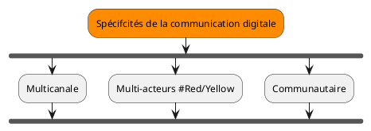
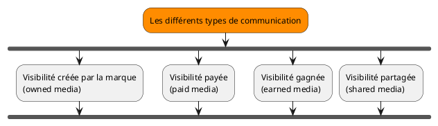
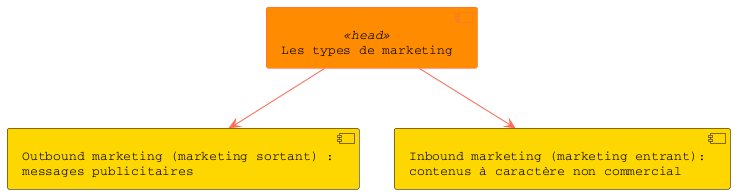

# Synthèse

## TITRE A TROUVER
Synthese
Définir une stratégie de communication digitale

[NOTE STT les couleurs fonctionnent mal en mode online]

La mise en place d'une stratégie éditoriale
Réaliser un audit
stratégique : utilisez
Tanalyse SWOT
Définir une cible
et construire
un persoha»
Fixer les objectifs
et definir
un budget
Choisir les canaux
t établir
un calendrier
La mise en place d'une stratégie de contenus
Choisir le canal et
la fréquence de publication
Définir la cible
et l'objectif
Choisir les contenus
et les mots-clés
Choisir le format
Les règles de rédaction sur le Web
Respecter la ligne
et la charte éditoriales
Respecter les règles
générales de lécriture Web
Respecterle cadre légal
et la nétiquette
ive
Testez vos connaissances sur le chapitre 7
Inbound marketing Outbound marketingNétiquette Ligne éditoriale
Charte éditoriale Persona
MOTS
CLES
