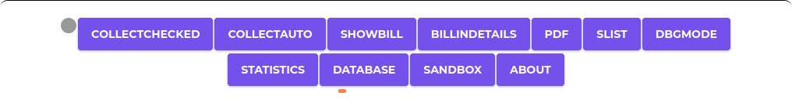
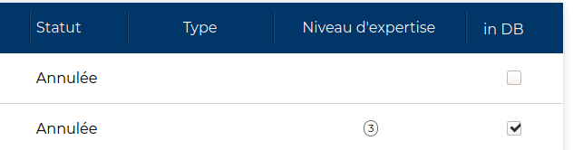
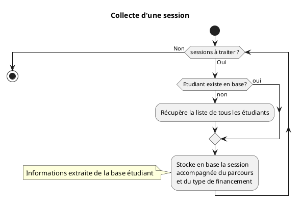
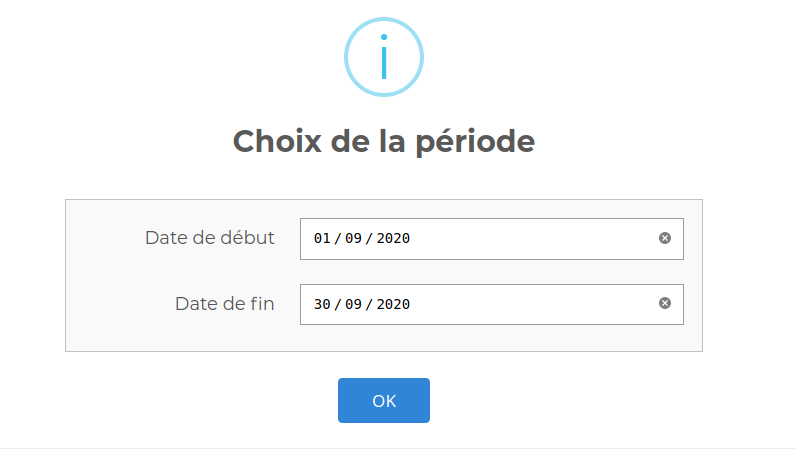
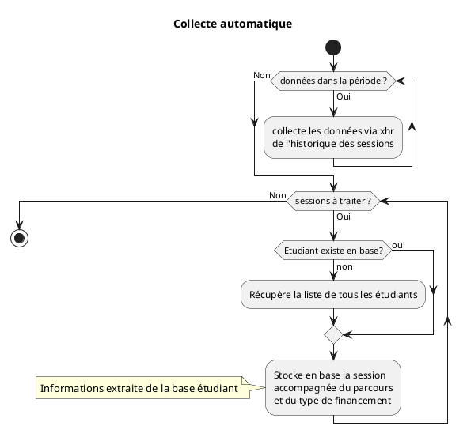

# La barre des actions



## COLLECTCHECKED

Cette fonctionnalité permet d'ajouter les sessions pour lesquels la case
" in DB " est coché d'ajouter la prestation à la base de données des sessions
 qui seront utilisés dans les calculs suivants
 

 
Le traitement se lance à l'issue
Concrètemenet voilà comment ça se passe




## COLLECTAUTO

Cette fonctionnalité vous permet de collecter l'ensemble
 des prestation de mentorat qui ont eue lieu durant la période choisie
 




## SHOWBILL

Affiche la liste des prestation à facturer pour le mois choisi à l'aide du sélécteur 
de date
Ces prestations sont classées par 
 - type (sessions..)
 - mode de financement (auto financé...)
 - état (réalisée...)
 - niveau


> Pour des raisons d'optimisation de performances, le calcul préalable à
 l'affichage factures des mois plus anciens que le mois en cours sont
  mises en cache, à l'issue du calcul
  
voir l'option database ci dessous pour supprimer ce cache 

A noter que le style de la grille est paramétrable, pour se faire il vous faudra
soit héberger un fichier css correspondant au style, soit inclure le
 style à la main dans le panneau de paramétrage prévu à cet effet
voir également le panneau de configuration pour paramétrer le style
 de la grille
 
## BILLINDETAIL

Affiche le détail des prestation pour le mois choisi à l'aide du sélécteur 
de date


> La méthode d'évaluation est délibéremment différente du calcul (SHOWBILL)
de manière à croiser les résultats en cas de doute

## DBGMODE

Ce bouton vous permet de rentrer dans un mode où la base de donnée et les différents composants de l'application sont disponibles

Quand vous avez cliqué sur ce bouton, il vous faut accéder à la console de votre navigateur pour voir


Vous pouvez voir s'afficher un ensemble d'exemple d'actions réalisables dans les différentes sections

exemple :

 - section base de donnée :
   - voir la dernière session enregistrée en base  :
   ```js
    d_dbase.get(d_Session.tbl_name).last().value();
    ```
  
 - section étudiant :
   - trouver un étudiant via son id  :
   ```js
    d_Student.findById(STUDENT_ID);
    ```
   - trouver une liste des sessions entre deux dates : 
    ```js
     d_Session.getBetween('2020-08-01','2020-08-31');
     ```

Pour voir la liste de toutes les actions disponibles je vous renvoie aux sections
 - Base de données
 - Objets

## PDF 

Ce bouton vous permet de sortir un état PDF des prestations à facturer.
Cet état est composé de deux états
 - la liste en brut des prestations de la période (équivalent pdf
  de #BILLINDETAILS), 
 - la liste en détail mais classée comme dans le tableau (#SHOWBILL)
    - type (sessions..)
    - mode de financement (auto financé...)
    - état (réalisée...)
    - niveau
