# Introduction

Cette application va vous permettre de réaliser votre facturation directement dans votre navigateur

## 

Attention ce temps est un temps prévisionnel du parcours

```plantuml
@startgantt
printscale weekly
[Cours] as [t01] lasts 10 days
[Quizz] as [t02] lasts 1 days
[Projet] as [t03] lasts 20 days
[t03] is colored in Lavender/LightBlue
[t01] links to [[#/FichRes01/finalDocPg1]]
[t02] starts at [t01]'s end
[t03] starts at [t02]'s end
@endgantt
```

## Contact & Support

- Create a [GitHub issue](https://github.com/jhildenbiddle/docsify-themeable/issues) for bug reports, feature requests, or questions
- Follow [@jhildenbiddle](https://twitter.com/jhildenbiddle) for announcements
- Add a ⭐️ [star on GitHub](https://github.com/jhildenbiddle/docsify-themeable) or ❤️ [tweet](https://twitter.com/intent/tweet?url=https%3A%2F%2Fgithub.com%2Fjhildenbiddle%2Fdocsify-themeable&hashtags=css,developers,frontend,javascript) to support the project!

## License

This project is licensed under the [MIT license](https://github.com/jhildenbiddle/docsify-themeable/blob/master/LICENSE).

Copyright (c) Stéphane TORCHY ([@jhildenbiddle](https://twitter.com/jhildenbiddle))

<!-- GitHub Buttons -->

